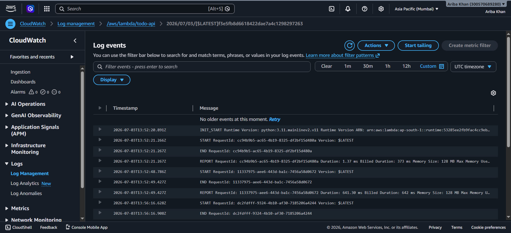

# AWS Serverless Todo API

A fully serverless REST API for managing todos — built on AWS Lambda, API Gateway, and DynamoDB, provisioned entirely through Terraform, with CI/CD via GitHub Actions and monitoring through CloudWatch.

---

##  Architecture

```
                    [ Client / Postman ]
                            |
                         HTTPS
                            |
                  [ API Gateway (REST) ]
                            |
                       Invoke
                            |
              [ Lambda Function: todo-api ]
                    /              \
                   /                \
        [ DynamoDB Table ]   [ CloudWatch Logs ]
           - todos                 - Invocation logs
                                    - Duration & memory metrics

              (IAM Role grants least-privilege
               access from Lambda to DynamoDB
               and CloudWatch)
```

**Flow:** A client request hits API Gateway, which invokes a Lambda function. The function performs the requested operation against a DynamoDB table and returns a response — with every invocation logged to CloudWatch for full observability.

---

##  Tech Stack

| Layer            | Technology              |
|-------------------|--------------------------|
| Compute           | AWS Lambda (Python)     |
| API Layer         | Amazon API Gateway      |
| Database          | Amazon DynamoDB         |
| Infrastructure    | Terraform               |
| CI/CD             | GitHub Actions          |
| Monitoring/Logs   | Amazon CloudWatch       |
| Testing           | Postman                 |

---

##  Highlights

- **Fully serverless** — no servers to provision or manage, scales automatically with demand
- **Infrastructure as Code** — the entire stack (19 AWS resources) is defined and provisioned through Terraform
- **Automated CI/CD** — GitHub Actions runs `terraform fmt`, `validate`, and `plan` on every push, with `apply` gated behind manual approval
- **Complete CRUD API** — create, read, update, and delete operations, each independently tested
- **Built-in observability** — every Lambda invocation logged to CloudWatch with execution duration and memory metrics

---

##  API Design

| Method | Endpoint            | Description          |
|--------|----------------------|-----------------------|
| POST   | `/todos`             | Create a new todo    |
| GET    | `/todos`             | Get all todos        |
| GET    | `/todos/{id}`        | Get a single todo    |
| PUT    | `/todos/{id}`        | Update a todo        |
| DELETE | `/todos/{id}`        | Delete a todo        |

---

##  Testing

All five operations were tested end-to-end using Postman, verifying correct status codes and response payloads for every route.

| Operation | Screenshot |
|-----------|------------|
| Create Todo (POST) | `screenshots/01-post-create.png` |
| Get All Todos (GET) | `screenshots/02-get-all.png` |
| Get One Todo (GET) | `screenshots/03-get-one.png` |
| Update Todo (PUT) | `screenshots/04-put-update.png` |
| Delete Todo (DELETE) | `screenshots/05-delete.png` |

---

##  Monitoring

Every Lambda invocation is logged to CloudWatch, capturing `START`, `END`, and `REPORT` events with execution duration and memory usage — giving full visibility into runtime performance.



---

##  CI/CD Pipeline

This project uses **GitHub Actions** to automatically validate infrastructure changes on every push — running `terraform fmt`, `terraform validate`, and `terraform plan`. Applying changes is gated behind a manual trigger for controlled, deliberate deployments.

---

---
## Author : **Ariba Khan**

